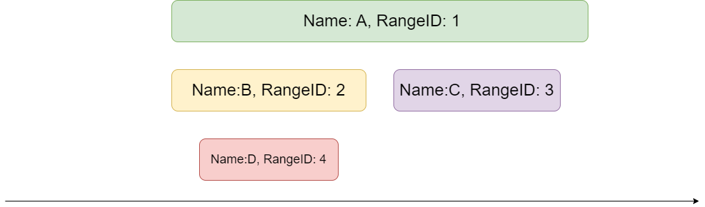

# XLA compilation profiling with NVTX
XLA has NVTX markers inserted in various places like XLAPass, CompileBackend etc.

# Workflow
* launch a container with nsys and xla installed:
```
docker run --gpus all -it ghcr.io/nvidia/jax:jax-2024-06-10
```
* Profile your application with
```
nsys -t nvtx -o output -f true [your application]
```
* dump NVTX results into csv file with
```
nsys stats --report nvtx_pushpop_trace --input output.nsys-rep --output output
```
* Print a simple summary using a customized python script:
```
python3 summary.py output_nvtx_pushpop_trace.csv > output_summary.txt 2>&1
```

# Summary
A simple summary looks like this:
```
Compilation: TSL:XlaCompile:#module=pjit__wrapped_step_fn,program_id=1#: 1.231992489
 XlaPass 71.75% 0.884
 XlaCompileBackend 18.71% 0.2305
 XlaAutotunerMeasurement 5.34% 0.06578
 XlaCreateGpuExecutable 1.41% 0.01738
 XlaDumpLlvmIr 0.72% 0.00883
 XlaBufferAssignment 0.63% 0.007816
```

You can change the summary.py to not aggregate XLA passes into single item to print like this:
```
Compilation: TSL:XlaCompile:#module=pjit__wrapped_step_fn,program_id=1#: 12.859785733
 TSL:XlaPass:#name=gemm-algorithm-picker,module=pjit__wrapped_step_fn,program_id=1# 65.29% 8.396
 TSL:XlaCompileBackend:#module=pjit__wrapped_step_fn,program_id=1# 11.05% 1.421
 TSL:XlaPass:#name=priority-fusion,module=pjit__wrapped_step_fn,program_id=1# 4.68% 0.6013
 TSL:XlaAutotunerMeasurement:#hlo_op=custom-call.113# 3.48% 0.4478
 TSL:XlaMemoryScheduler:#module=pjit__wrapped_step_fn,program_id=1# 2.42% 0.3117
 TSL:XlaPass:#name=algsimp,module=pjit__wrapped_step_fn,program_id=1# 1.18% 0.1514
 TSL:XlaBufferAssignment:#module=pjit__wrapped_step_fn,program_id=1# 1.15% 0.1479
 TSL:XlaPass:#name=multi_output_fusion,module=pjit__wrapped_step_fn,program_id=1# 1.03% 0.1325
 TSL:XlaCreateGpuExecutable:#module=pjit__wrapped_step_fn# 1.02% 0.1306
 TSL:XlaPass:#name=copy-insertion,module=pjit__wrapped_step_fn,program_id=1# 0.79% 0.1016
 TSL:XlaPass:#name=cublas-gemm-rewriter,module=pjit__wrapped_step_fn,program_id=1# 0.50% 0.0645
 TSL:XlaEmitLlvmIr:#module=pjit__wrapped_step_fn,program_id=1# 0.46% 0.05922
 TSL:XlaDumpLlvmIr:#module=pjit__wrapped_step_fn,program_id=1# 0.42% 0.05377
 TSL:XlaPass:#name=layout_normalization,module=pjit__wrapped_step_fn,program_id=1# 0.38% 0.0483
 TSL:XlaPass:#name=latency-hiding-scheduler,module=pjit__wrapped_step_fn,program_id=1# 0.36% 0.04681
 TSL:XlaPass:#name=layout-assignment,module=pjit__wrapped_step_fn,program_id=1# 0.35% 0.04453
 TSL:XlaPass:#name=spmd-partitioning,module=pjit__wrapped_step_fn,program_id=1# 0.31% 0.04016
 TSL:XlaDumpHloModule:#module=pjit__wrapped_step_fn,program_id=1# 0.30% 0.03883
 TSL:XlaPass:#name=constant_folding,module=pjit__wrapped_step_fn,program_id=1# 0.28% 0.03563
 TSL:XlaPass:#name=rematerialization,module=pjit__wrapped_step_fn,program_id=1# 0.24% 0.03115
 TSL:XlaPass:#name=dce,module=pjit__wrapped_step_fn,program_id=1# 0.20% 0.02533
 TSL:XlaPass:#name=cudnn-fused-convolution-rewriter,module=pjit__wrapped_step_fn,program_id=1# 0.20% 0.02523
 TSL:XlaPass:#name=cse,module=pjit__wrapped_step_fn,program_id=1# 0.19% 0.02417
 TSL:XlaPass:#name=gpu-tree-reduction-rewriter,module=pjit__wrapped_step_fn,program_id=1# 0.18% 0.02357
 TSL:XlaPass:#name=sharding-propagation,module=pjit__wrapped_step_fn,program_id=1# 0.17% 0.02158
 TSL:XlaPass:#name=dynamic_padder,module=pjit__wrapped_step_fn,program_id=1# 0.13% 0.01698
 TSL:XlaPass:#name=sanitize-constant-names,module=pjit__wrapped_step_fn,program_id=1# 0.12% 0.01488
 TSL:XlaPass:#name=computation-deduplicator,module=pjit__wrapped_step_fn,program_id=1# 0.11% 0.01462
 TSL:XlaPass:#name=host-offloader,module=pjit__wrapped_step_fn,program_id=1# 0.10% 0.01348
 TSL:XlaPass:#name=gpu_horizontal_input_fusion,module=pjit__wrapped_step_fn,program_id=1# 0.09% 0.01181
 TSL:XlaPass:#name=command-buffer-scheduling,module=pjit__wrapped_step_fn,program_id=1# 0.08% 0.01021
 TSL:XlaPass:#name=simplify-while-loops,module=pjit__wrapped_step_fn,program_id=1# 0.08% 0.01005
 TSL:XlaAutotunerMeasurement:#hlo_op=custom-call.186# 0.07% 0.009215
 TSL:XlaAutotunerMeasurement:#hlo_op=custom-call.147# 0.07% 0.009212
 TSL:XlaPass:#name=all-reduce-combiner,module=pjit__wrapped_step_fn,program_id=1# 0.07% 0.008901
 TSL:XlaAutotunerMeasurement:#hlo_op=custom-call.185# 0.07% 0.008809
 TSL:XlaAutotunerMeasurement:#hlo_op=custom-call.187# 0.06% 0.00832
 TSL:XlaAutotunerMeasurement:#hlo_op=custom-call.189# 0.06% 0.008282
 TSL:XlaAutotunerMeasurement:#hlo_op=custom-call.148# 0.06% 0.008149
 TSL:XlaPass:#name=scatter_expander,module=pjit__wrapped_step_fn,program_id=1# 0.06% 0.007921
 TSL:XlaPass:#name=CallInliner,module=pjit__wrapped_step_fn,program_id=1# 0.06% 0.007823
 TSL:XlaAutotunerMeasurement:#hlo_op=custom-call.120# 0.06% 0.007795
 TSL:XlaAutotunerMeasurement:#hlo_op=custom-call.149# 0.06% 0.00778
 TSL:XlaAutotunerMeasurement:#hlo_op=cublas-gemm.25# 0.06% 0.007588
 TSL:XlaPass:#name=reduce-scatter-combiner,module=pjit__wrapped_step_fn,program_id=1# 0.06% 0.00742
 TSL:XlaAutotunerMeasurement:#hlo_op=custom-call.122# 0.06% 0.007385
 TSL:XlaAutotunerMeasurement:#hlo_op=custom-call.150# 0.06% 0.007346
 TSL:XlaPass:#name=zero_sized_hlo_elimination,module=pjit__wrapped_step_fn,program_id=1# 0.06% 0.007259
 TSL:XlaPass:#name=transpose-folding,module=pjit__wrapped_step_fn,program_id=1# 0.05% 0.007055
 TSL:XlaPass:#name=all-gather-combiner,module=pjit__wrapped_step_fn,program_id=1# 0.05% 0.007042
 TSL:XlaPass:#name=gather_expander,module=pjit__wrapped_step_fn,program_id=1# 0.05% 0.006442
 TSL:XlaPass:#name=tuple-simplifier,module=pjit__wrapped_step_fn,program_id=1# 0.05% 0.006411
 TSL:XlaPass:#name=dynamic-dimension-simplifier,module=pjit__wrapped_step_fn,program_id=1# 0.05% 0.006325
 TSL:XlaPass:#name=reshape-mover,module=pjit__wrapped_step_fn,program_id=1# 0.05% 0.006255
 TSL:XlaPass:#name=dot_decomposer,module=pjit__wrapped_step_fn,program_id=1# 0.05% 0.006241
 TSL:XlaPass:#name=scatter-slice-simplifier,module=pjit__wrapped_step_fn,program_id=1# 0.05% 0.006106
 TSL:XlaPass:#name=gpu_horizontal_loop_fusion,module=pjit__wrapped_step_fn,program_id=1# 0.05% 0.006037
 TSL:XlaPass:#name=float-normalization-bf16,module=pjit__wrapped_step_fn,program_id=1# 0.04% 0.00573
 TSL:XlaPass:#name=dot_dimension_sorter,module=pjit__wrapped_step_fn,program_id=1# 0.04% 0.005299
 TSL:XlaPass:#name=hlo-verifier,module=pjit__wrapped_step_fn,program_id=1# 0.04% 0.005294
 TSL:XlaPass:#name=scatter_simplifier,module=pjit__wrapped_step_fn,program_id=1# 0.04% 0.004818
 TSL:XlaPass:#name=gather_simplifier,module=pjit__wrapped_step_fn,program_id=1# 0.04% 0.004698
```

# nsys-jax
https://github.com/NVIDIA/JAX-Toolbox/blob/main/docs/profiling.md#nsys-jax-wrapper-for-nsight-systems

* nsys-jax does the above steps for you. Inside the container run:
```
nsys-jax [nsys profile options] -- [your application]
```

* move the `.zip` file into an interactive environment and unzip it
* Inside the unzip directory, run
```
./install.sh
```
It will launch a jupyter notebook with various analysis, which also includes the compilation breakdown


# CSV format
You might want to write your own script to parse the NVTX marker results. The csv file dump of `nsys stats --report nvtx_pushpop_trace --input output.nsys-rep` usually looks like this:
```csv
Start (ns),End (ns),Duration (ns),DurChild (ns),DurNonChild (ns),Name,PID,TID,Lvl,NumChild,RangeId,ParentId,RangeStack,NameTree
129466419083,129469614334,3195251,0,3195251,"TSL:XlaDumpHloModule:#module=jit__psum,program_id=0#",2286673,2286673,0,0,125597,,:125597,"TSL:XlaDumpHloModule:#module=jit__psum,program_id=0#"
129469619302,129914331259,444711957,169945965,274765992,"TSL:XlaCompile:#module=jit__psum,program_id=0#",2286673,2286673,0,22,125601,,:125601,"TSL:XlaCompile:#module=jit__psum,program_id=0#"
```


* Start (ns): start time
* End (ns): end time
* Duration (ns): duration time
  * End - Start
* DurChild (ns): time spent in child range
* DurNonChild (ns): time spent in non child range
  * Duration - DurChild
  * Assuming A has Duration of 100, B has Duration of 40, C has Duration of 50, then DurNonChild for A would be 10, DurChild for A would be 90.
* Name: Assigned name of the current range
* PID: process id
* TID: thread id
* Lvl: nested level of the current range
  * For A, the Lvl would be 0
  * For D, the Lvl would be 2
* RangeId: unique id of the current range
* ParentId: unique id the parent range
* RangeStack: stacks of the nested ranges
  * For C, the RangeStack would be 1:3
  * For D, the RangeStack would be 1:2:4

So for the above example, the csv file would look like this:
```csv
Start (ns),End (ns),Duration (ns),DurChild (ns),DurNonChild (ns),Name,PID,TID,Lvl,NumChild,RangeId,ParentId,RangeStack
0,100,100,90,10,"A",12345,12345,0,2,1,,:1
0,40,40,30,10,"B",12345,12345,1,1,2,1,1:2
45,95,50,0,50,"C",12345,12345,1,0,3,1,1:3
5,35,30,0,30,"D",12345,12345,2,0,4,2,1:2:4
```